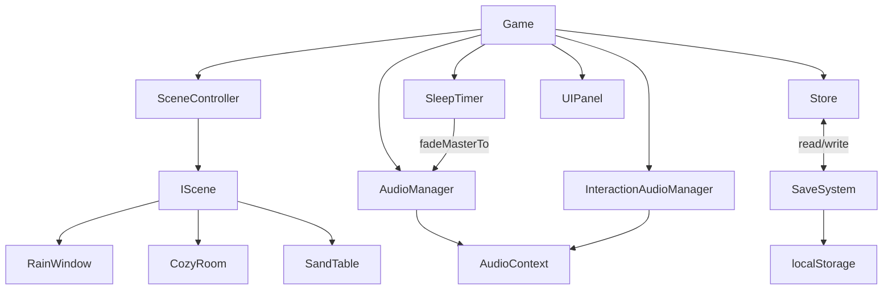

# Architecture

## High-Level Diagram

```
┌─────────────────────────────────────────────────────────────────┐
│                           Game (orchestrator)                   │
│                                                                 │
│  ┌──────────────────┐   ┌──────────────────────────────────┐   │
│  │  SceneController │   │  AudioManager                    │   │
│  │  ┌────────────┐  │   │  (master bus, ambient loops,     │   │
│  │  │  IScene    │  │   │   per-track volume faders)       │   │
│  │  │ ──────────  │  │   ├──────────────────────────────── │   │
│  │  │ RainWindow │  │   │  InteractionAudioManager         │   │
│  │  │ CozyRoom   │  │   │  (3-layer tap / drag / hold)     │   │
│  │  │ SandTable  │  │   └──────────┬───────────────────────┘   │
│  │  └────────────┘  │              │                           │
│  └────────┬─────────┘         AudioContext                     │
│           │                                                     │
│  ┌────────▼─────────┐   ┌──────────────────────────────────┐   │
│  │  Three.js loop   │   │  Store (pub/sub)                 │   │
│  │  renderer.render │   │  ↕                               │   │
│  └──────────────────┘   │  SaveSystem (localStorage)       │   │
│                         └──────────────────────────────────┘   │
│                                                                 │
│  ┌───────────────────────────────────────────────────────────┐ │
│  │  SleepTimer ──fadeMasterTo──▶ AudioManager               │ │
│  └───────────────────────────────────────────────────────────┘ │
│                                                                 │
│  ┌───────────────────────────────────────────────────────────┐ │
│  │  UIPanel subclasses (managed screens)                     │ │
│  │  Splash │ Home │ Player │ Mixer │ Timer │ Settings │       │ │
│  │  Paywall │ Onboarding                                      │ │
│  └───────────────────────────────────────────────────────────┘ │
└─────────────────────────────────────────────────────────────────┘
```

Mermaid equivalent (paste into any Mermaid viewer):



---

## Module Responsibilities

**`src/audio/`** — Owns the Web Audio graph. `AudioManager` manages the master gain bus, per-track ambient loop players, and cross-fade logic. `InteractionAudioManager` handles the three-layer interaction model (tap, drag, hold) with randomised sample selection. `sceneAudioRegistry` maps scene IDs to their required audio tracks. `assetManifest` lists every WAV with its URL and metadata so the loader can pre-buffer on scene entry.

**`src/content/`** — Pure data. `scenes.ts` exports scene metadata (id, label, tier, thumbnail path). `soundPacks.ts` exports pack metadata including `tier: 'free' | 'premium'` gating. No logic lives here — other modules import from this directory and own the behaviour.

**`src/effects/`** — Self-contained Three.js post-processing effects that are added to a scene's render pass chain. `CondensationTrail` draws moisture bead streaks on the glass surface; `RainGlassOverlay` composites an animated rain-droplet texture over the camera output.

**`src/game/`** — The application shell. `Game.ts` boots the engine, wires all subsystems together, and routes user input to the appropriate handler. `SceneController` manages the IScene lifecycle (load, swap, dispose). `state.ts` is the pub/sub reactive store. `SaveSystem` serialises store state to localStorage, strips transient keys, and applies schema-version migrations on load. `subscription.ts` holds IAP gate logic (currently stubbed — see CONTRIBUTING.md). `config.ts` holds compile-time constants.

**`src/render/`** — Thin wrappers around Three.js primitives. `renderer.ts` creates and sizes the `WebGLRenderer`. `camera.ts` creates the perspective camera and handles viewport resize. `lighting.ts` builds the ambient + directional light rig. `scene.ts` provides a factory for empty Three.js `Scene` objects with consistent fog/background defaults.

**`src/scenes/`** — `IScene.ts` defines the interface (`init`, `update(dt)`, `dispose`, `onInteraction`). Each concrete scene (`RainWindowScene`, `CozyRoomScene`, `SandTableScene`) implements the interface and owns its geometry, materials, and per-frame animation. `rainWindowConfig.ts` externalises the tuning constants for the rain scene so they can be tweaked without touching scene logic.

**`src/systems/`** — Platform-level subsystems. `InputSystem` unifies pointer and touch events into a normalised event stream. `SleepTimer` counts down and calls `AudioManager.fadeMasterTo(0)` on expiry. `HapticsSystem` wraps `@capacitor/haptics`. `GyroLookSystem` reads device-orientation events and applies a subtle parallax offset to the camera. `native.ts` is a thin bridge to other Capacitor plugins, centralising all `Capacitor.isNativePlatform()` guards. `save.ts` re-exports `SaveSystem` from `game/` for use in systems that shouldn't import from `game/` directly.

**`src/ui/`** — `UIPanel.ts` is the base class: it creates a `<div>` root, manages `show`/`hide` transitions, and exposes a `render()` lifecycle hook. Each subclass (`splash.ts`, `home.ts`, `player.ts`, `mixer-panel.ts`, `timer-modal.ts`, `settings.ts`, `paywall.ts`) owns one screen's HTML template and event bindings. Panels communicate back to `Game` via callbacks passed at construction time — there is no direct DOM manipulation outside a panel's own root element.

---

## Data Flow

```
User gesture
  → InputSystem (normalised PointerEvent)
    → Game.onInput callback
      ├→ InteractionAudioManager.trigger(type, position)
      ├→ active IScene.onInteraction(event)
      └→ Store.dispatch(action)
           ├→ UIPanel(s) re-render via Store subscription
           └→ SaveSystem.persist() (debounced)
```

---

## Persistence

`SaveSystem` serialises the reactive `Store` state to `localStorage` under the key `asmr_save_v{schemaVersion}`. On load it reads the raw JSON, checks `schemaVersion`, and runs any pending migration functions before rehydrating the store. A `TRANSIENT_KEYS` set (defined in `config.ts`) lists keys that must never be persisted (e.g. `isPlaying`, `currentScene`) — these are stripped before each write.

---

## Three.js Scene Lifecycle

```
SceneController.load(sceneId)
  → IScene.init(renderer, camera)   // build geometry, load textures, start audio
  → register scene in animate loop
  → per frame: IScene.update(deltaSeconds)
  → SceneController.swap(newSceneId)
       → old IScene.dispose()       // release GPU memory, stop audio
       → new IScene.init(...)
```

Scenes must release all `BufferGeometry`, `Material`, and `Texture` objects in `dispose()` to prevent GPU memory leaks during scene swaps.

---

## Background Audio Caveat

When the app is backgrounded on iOS/Android the Web Audio context is suspended by the OS. Resuming ambient loops reliably requires a native music-controls plugin. `@capacitor-community/music-controls` integration is **pending (Phase 5)** — see CONTRIBUTING.md "Pending integrations" for the exact stub locations.
